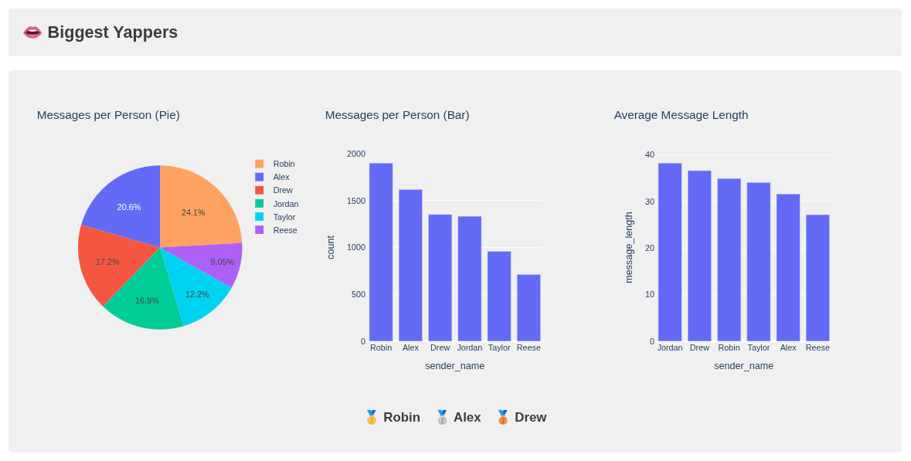

# 💬 WhatsApp Group Visualized

A simple Plotly Dashboard for visualizing your friend groups writing patterns.

## ✨ Showcase

<p align="center">
    
    
</p>

*You can see more plots in the examples folder.*

## 🛠️ Setup
First you need to extract your groups data from WhatsApp. To do so follow [this guide](./DATA_EXTRACTION.md).


## 📥 Installation

### Option 1 - Install from GitHub
#### Clone the repository:
```bash
git clone git@github.com:theopfr/whatsapp-group-visualized.git
cd whatsapp-group-visualized
```

#### Create a virtual environment:
For example using ``uv``:
```bash
uv venv
source .venv/bin/activate
uv pip install -r requirements.txt
```

#### Run:
After following the rest of the steps you can start the dashboard using:
```bash
python src/dashboard.py
```

### Option 2 - Using Docker
#### Setup project
In case you didn't clone this repository create a new folder on your machine or server. Then do the following:
1. Create ``your-folder/data/``
2. Copy the ``config.json`` from this repo into ``your-folder/data/``, leave it for now
3. Copy the ``docker-compose.yml`` file from this repo into  ``your-folder/docker-compose.yml``

#### Run:
After following the rest of the steps you can start the dashboard using:
```bash
docker-compose up
```

### Setup data and config.json:
Make sure your extracted group chat is inside the ``./data/group-chat.csv`` by following the guide above.

Next, add all the relevant data to the ``./data/config.json``. It is already filled with examplary data and consist of the following:
- the groups name (must not match the actual name on WhatsApp)
- the ``jidMap``: Maps the sender-ids to name-identifiers which will be shown in the visualization, this needs to be done manually (must not match the actual names on WhatsApp)
- ``other``: Names to be grouped into a "other", for example for inactive users (names must have been defined in ``jidMap``)
- ``excludeOthers``: Wether to show data for the "other" or ignore in in the visualizations
- ``senderAliases``: Aliases/pet-names for the senders, needed to visualize who mentions who the most even when not addressing them with the real name
